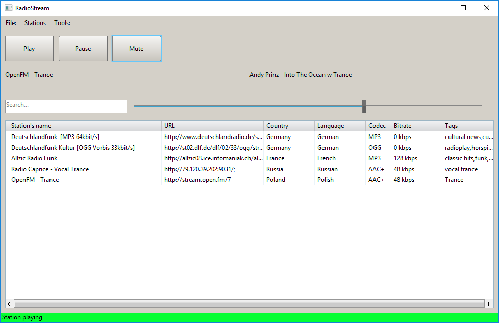
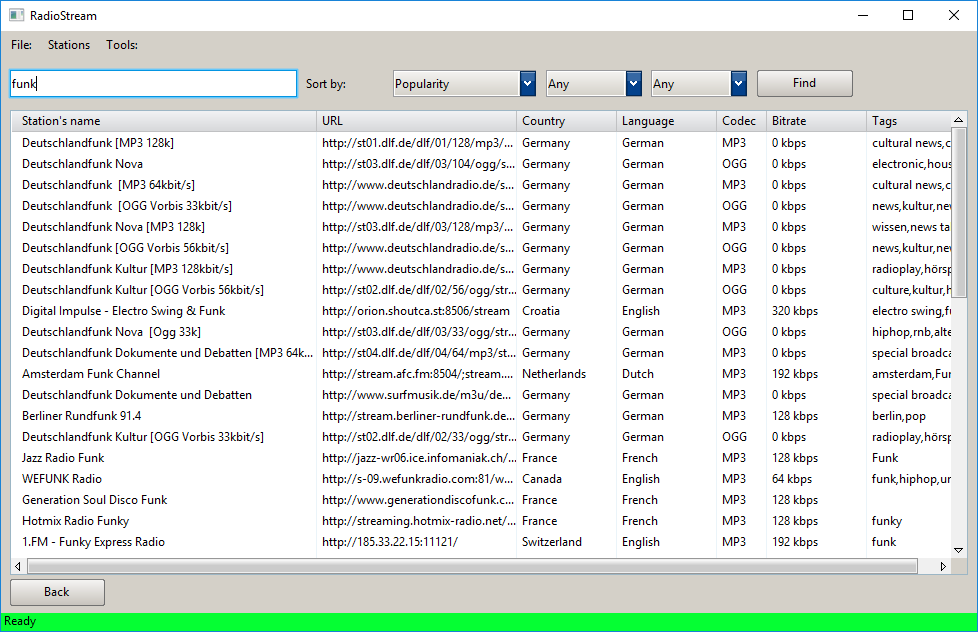

# States

*State* represents all the things that can be seen within
application window at one point in time. Basically state
represents current visible set of widget within a application
window. 

For example *`MainState`* is a most used and a default page
used by a user. It shows list of user saved stations and
buttons related to playback alogn with text fields for current
playing song and station.



*`SearchState`* is representing a GUI state when user want to
search for radio stations as if in a browser.



All of such states have corresponding classes in the codebase.

*`MainState`* in `states/MainState.hpp`.
*`SearchState`* in `states/SearchState.hpp`.

All `*State` class implement `State` which looks as follows:    
```c++
class State : public Subject {
   public:
    virtual ~State() = default;

    /**
     * \brief Context represents a structure containing references to items use
     * throughout all states
     */
    struct Context {
        Context(nana::form& window, nana::menubar& menubar,
                StationPlayer& station_player,
                StationsDatabase& stations_database, StatusBar& status,
                TextLocalizer& localizer, Config& config,
                RadioBrowserRequester& requester) noexcept;
        nana::form& window_;
        nana::menubar& menubar_;
        StationPlayer& station_player_;
        StationsDatabase& stations_database_;
        StatusBar& status_;
        TextLocalizer& localizer_;
        Config& config_;
        RadioBrowserRequester& requester_;
    };
    State(StatesManager& state_manager, Context& context);
    virtual void change_visibility(bool visible) = 0;

   protected:
    void switch_state(States::ID id) const;
    Context& context_;

   private:
    StatesManager& manager_;
};
```

`Context` is an object that contains references to all things
that are used throughout all states like `localizer_` which
enables state to display widget texts in different languages.
All classes deriving from `State` must have access to this
object.

There exists one pure virtual method that needs to be
implemented and that is `change_visibility`.

```c++
virtual void change_visibility(bool visible) = 0;
```

It is used when states are being changed for example user
currently has main page opened and decides to search for some
new radio stations. Each state know which widgets are
its responsibility so it should make them (in)visible on
demand.